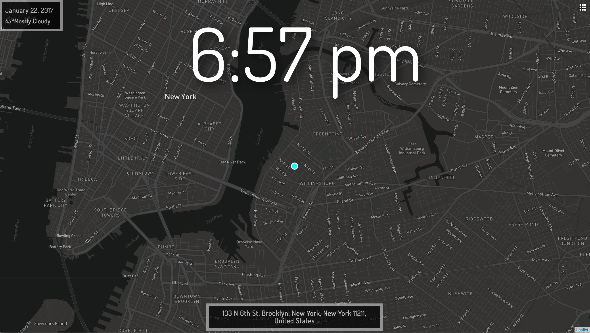
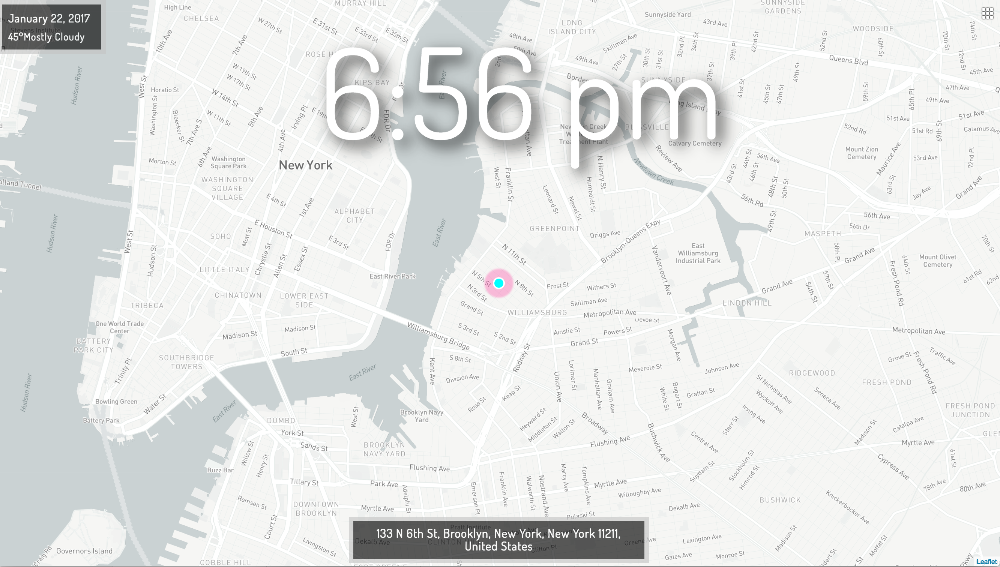
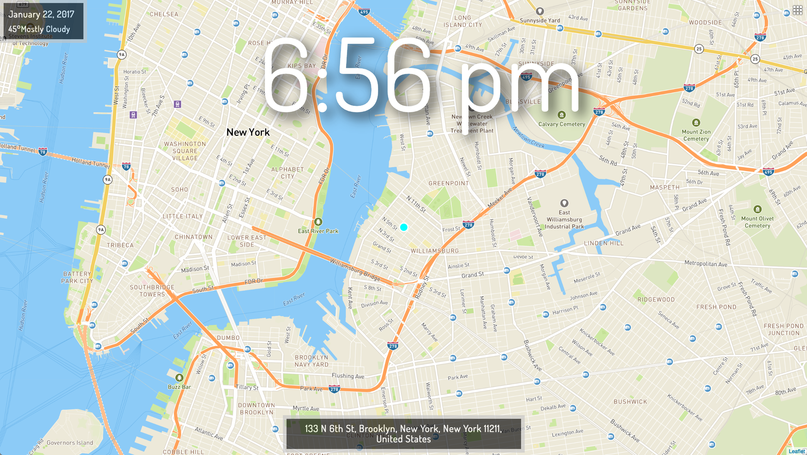
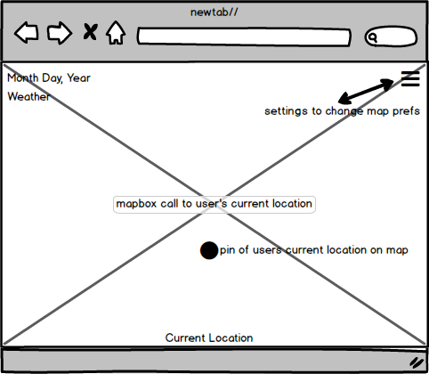
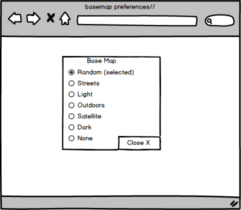

## CHROMEO DASH

This is a Chrome extension that shows your current location, weather, date, & time in new tabs!
---
## User Stories
* As a user, I can install this application as a Google Chrome extension.
* As a user, I can navigate to the deployed version of this application.
* As a user, I can view today's current date in local time.
* As a user, I can view today's current local temperature.
* As a user, I can view the exact coordinates of my loction.
* As a user, I can change my base map preferences.
* As a user, I can select a random base map to load.
* As a user, I can default to a pre-loaded background picture rather than a base map.

## Media
### Screenshots







### Wireframes




## Installation

I'm using my personal Mapbox and DarkSky keys for this project right now, therefore please feel free to submit an issue request should you wish to install this extension on your local machine.  I hope to push this to the app store soon!

Clone this repo and install as a Chrome extension locally. To install, open up Chrome and navigate to "Extensions" in the settings.  Choose the "Load unpacked extension" option.  From there, select the `build` directory of this repo.

## Developing

This project uses [create-react-app](https://github.com/facebookincubator/create-react-app), so you should check there for detailed instructions but it's mostly just:

```
cd /path/to/chromeo-dash
npm install
npm start
```
Please make sure you have your own MapBox & DarkSky tokens loaded in the Keys.js and Tilemap.js files.  Otherwise, you may submit an issue request for an original clone.  After installing, you should see a new live updating browser tab with this application!

## Special Thanks
I couldn't have done this without...
* [MapBox](https://www.mapbox.com)
* [DarkSky](https://darksky.net)
* [Leaflet](http://leafletjs.com/)
* [Moment](https://momentjs.com/)
* [Turfjs](https://github.com/Turfjs/turf-distance)
* [pixabay](https://pixabay.com/)
* [imgur](http://imgur.com/)
* [npm](https://www.npmjs.com)
* [bootstrap](http://getbootstrap.com/)
* [MapTab](https://github.com/bsudekum/MapTab)
* [Github](https://github.com/)
* [StackOverflow](http://stackoverflow.com/)
